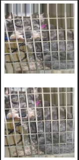
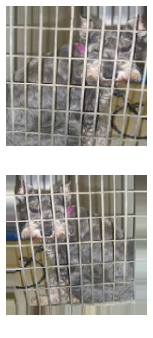
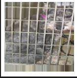
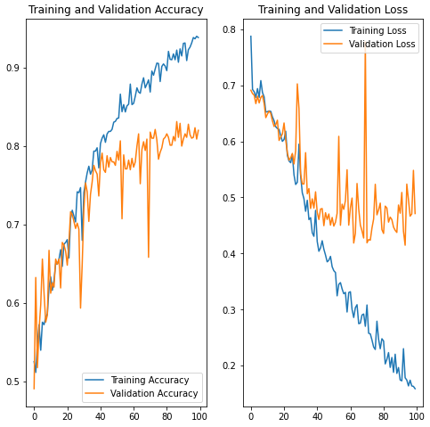

# Cat-Dogs-Classifier:
Cats and dogs classifications using a deep neural network.
### Network Architecture:
  | -  | Layer          | I/O Shape                       |
  |----|----------------|---------------------------------|
  | 1  | Conv2d_1       | (150, 150, 3) / (148, 148, 32)  |
  | 2  | ReLU_1         | (148, 148, 32) / (148, 148, 32) |
  | 3  | MaxPooling2d_1 | (148, 148, 32) / (74, 74, 32)   |
  | 4  | Conv2d_2       | (74, 74, 32) / (73, 73, 64)     |
  | 5  | ReLU_2         | (73, 73, 64) / (73, 73, 64)     |
  | 6  | MaxPooling2d_2 | (73, 73, 64) / (36, 36, 64)     |
  | 7  | Conv2d_3       | (36, 36, 64) / (34, 34, 128)    |
  | 8  | ReLU_3         | (34, 34, 128) / (34, 34, 128)   |
  | 9  | MaxPooling2d_3 | (34, 34, 128) / (17, 17, 128)   |
  | 10 | Conv2d_4       | (17, 17, 128) / (16, 16, 256)   |
  | 11 | ReLU_4         | (16, 16, 256) / (16, 16, 256)   |
  | 12 | MaxPooling2d_3 | (16, 16, 256) / (8, 8, 256)     |
  | 13 | Flatten        | (8, 8, 256) / 16384             |
  | 14 | Dropout_1      | 16384 / 16384                   |
  | 15 | Dense_1        | 16384 / 500                     |
  | 16 | ReLU_5         | 500 / 500                       |
  | 17 | Dropout_2      | 500 / 500                       |
  | 18 | Dense_2        | 500 / 1                         |
  | 19 | Sigmoid        | 1 / 1                           |

### Preprocessing:
* Images are rescaled to be 150 * 150 pixels images.
* The color range is re-scaled from [0, 255] to be in range of [0, 1].
## Data augmentation:
* Images go through random flipping, height/width shifting, zooming transformations.

### Training:
The model trained for 15 epochs with path size of 128. [Nadam](http://cs229.stanford.edu/proj2015/054_report.pdf) is used as the optimizer with 0.001 learning rate and binary cross entropy as the loss function.

### Results:
The model successfully classified 88% of the test data set.
